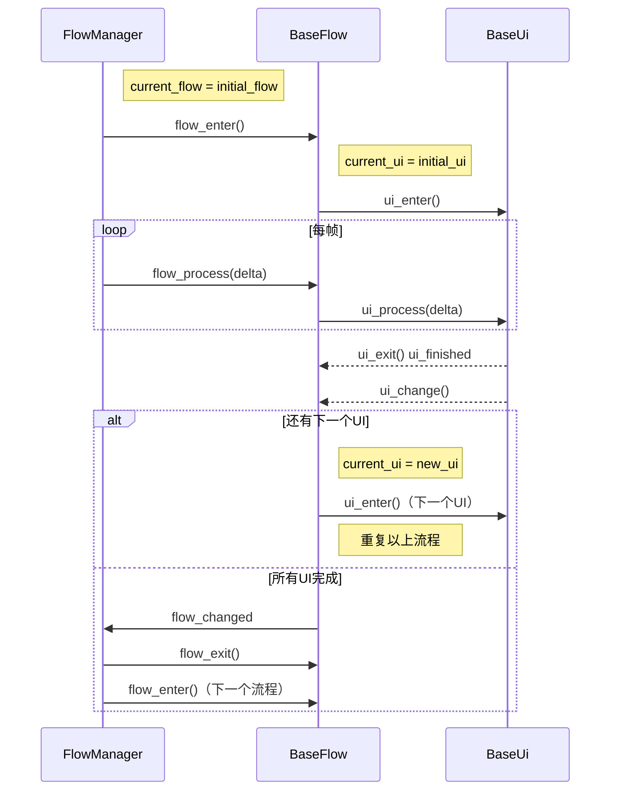

# 营造司物语游戏开发文档

该文档主要是讲解游戏的设计思路、 各个类的代码和实现的各个功能点，供开发人员参考和使用。

[Toc]

 
# 员工资源和建筑资源（基石和核心）

## 前提

显然，我们的游戏是一个较为简单的数值驱动的模拟经营类游戏，玩家通过员工的能力值和状态对所建造建筑的属性值产生影响，而如何驱动玩家不断进行 `想方法使用更高级的员工 -> 建造更高级的建筑 -> 获得更好的奖励 -> 有办法使用更高级的员工` 的循环，就在于数值的直观体现和模拟经营的体验感，同时在这个循环加入更多的有限自由度和策略手段，使游戏流程能够延长，这里就不过多赘述。

所以首先是要先确定 `员工` 和 `建筑` 的属性值存储，因为所有的游戏操作和系统，简单来说，就是对 `员工` 和 `资源` 的属性值做手脚，那么在Godot里显然是使用`Resource`类，即资源，是更有优势的，一方面`Resource`类的全局共享方便游戏系统的直接操作，另一方面`Resource`类相较于`Node`类更加轻量。

同时在我们的策划里，我们已经规定好了，`员工` 和 `建筑` 的属性值总共分为四类 : `风水类`、`射击类` 、`匠心类`、 `工料类`，所以我就先规定了`BaseResource`类 作为稍后的 `CraftsmanResource` 和 `BuildingResource`两个类的父类

## BaseResource类

接下来我们讲解一下 `BaseResource`类的代码

枚举类型的 `PROPERTY`，这个枚举类型主要是供全局访问的，提供索引值的
>enum PROPERTY { 风水类, 设计类, 匠心类, 工料类 }


字典类型的 `values`，负责存储`员工资源`或`建筑资源`的属性值，同时内部含有`set`方法防止数据溢出
>@export var values: Dictionary

输入索引值返回相应的属性值
>func return_value(index: PROPERTY) -> int:

输入索引值增加相应的属性值
>func add_value(index : PROPERTY) -> void :


## CraftsmanResource类

`CraftsmanResource`类继承自`BaseResource`类，主要是用来存储员工资源的属性值，同时增加了员工的基础信息（如name、profession、cost、level、experience、max_energy等），方便在编辑器中可视化配置和调整

同时员工有等级（level）、经验（experience）和精力（energy）等成长属性，等级和经验、精力影响员工的工作表现

然后再加上员工相应的能力值的影响，通过`return_craftsman_effect`方法来输出总体的员工的`影响值`，这个方法的输入参数是一个`delta`值（因为是增量计算）和一个`prop_config`（代表所需要的属性配置），输出值是一个浮点数，代表员工对建筑的增值效果
>func return_craftsman_effect(delta : float, prop_config : BaseResource.PROPERTY) -> float:

## BuildingResource类

`BuildingResource`类继承自`BaseResource`类，主要是用来存储建筑资源的属性值，同时增加了建筑的基础信息（如name、type、cost、level等），方便在编辑器中可视化配置和调整

建筑支持`上分`、`中分`、`下分`三层主题（top_theme、middle_theme、buttom_theme），每层可单独配置不同的ThemeResource，实现建筑外观和属性的多样化与组合。

提供add_theme方法，可根据主题类型动态为建筑添加或更换指定层的主题资源，便于在游戏流程中灵活调整建筑主题。
>func add_theme(type : ThemeResource.TYPE, theme_resource : ThemeResource) -> void:

通过return_themes_is_full方法，快速判断建筑的三层主题是否都已配置齐全，便于后续流程（主题选取）的判断和处理。
>func return_themes_is_full() -> bool:


# 建筑建造流程

在完成 `员工资源` 和 `建筑资源` 的设计和实现后，我们就可以开始设计游戏的核心流程——建筑建造流程，建筑建造流程分为四个环节：`风水勘探` `设计建筑` `建造建筑` 和 `计算工料`，每个环节都有不同的UI界面和交互逻辑

而为了实现建造流程，我利用了 `双层嵌套状态机`，`FlowManager`管理环节的切换，每个流程又有自己的状态机来管理不同ui的切换和逻辑处理，因此我将其抽象成三个类: `FlowManager`、`BaseFlow` 和 `BaseUi`，然后再搭载到`Building`类上



## FlowManager类
FlowManager 维护一个流程（BaseFlow类）数组 `flows`，按顺序依次执行。每个流程代表建造环节中的一个大步骤。利用节点机制，在`_ready()`函数里通过`get_children()`方法，将`FlowManager`节点下的所有子节点（即各个`BaseFlow`）添加到`flows`数组中，确保流程的自动识别和管理。

`open_flow_manager()`在`Building`类中被调用，负责启动流程管理器，设置当前流程为初始流程，并触发流程的进入逻辑。通过调用`current_flow.flow_enter()`方法，开始执行第一个流程的逻辑，确保游戏流程能够顺利启动和进行。
```python
func open_flow_manager() -> void:
    current_flow = initial_flow
```
## BaseFlow类

状态机部分和FlowManager类似，维护一个UI（BaseUi类）数组 `uis`，按顺序依次执行。每个UI代表流程中的一个小步骤。利用节点机制，在`_ready()`函数里通过`get_children()`方法，将`BaseFlow`节点下的所有子节点（即各个`BaseUi`）添加到`uis`数组中，确保UI的自动识别和管理。

同时搭载 `BuildingResource`类的实例 `building_resource`, `CraftsmanManager`类的实例 `craftsman_manager`，并分配给所属UI，方便流程内的UI直接访问和修改建筑资源的属性值，实现流程内数据的共享和交互。

搭载 `BuildPropConfig`类的实例 `prop_config`, 代表当前流程所需要的属性配置，并分配给所属UI，方便流程内的UI根据当前流程的属性需求进行相应的逻辑处理和数值计算。


## BaseUi类

```py
@export var craftsman_manager : CraftsmanManager
@export var building_resource : BuildingResource
@export var text : String = "测试标题"
@onready var label: Label = $Label
@export var prop_configs : Array[BuildPropConfig]
#引用节点
@onready var l_container: VBoxContainer = $Left/VBoxContainer
@onready var r_container: VBoxContainer = $Right/VBoxContainer
```

将ui分为左右两部分，即左容器和右容器

同时规定一系列虚函数，以便后续的子类Ui进行重写，完成不同UI界面的逻辑处理和交互设计

然后在`BaseUi`类的基础之上，我根据Ui的用途大致分为两个类 `AttributionUi` 和 `ChoiceUi`，前者主要是用来展示属性值的，后者主要是用来进行选择的。

然后每个类都根据自己的需求写相应的函数，这里就不过多赘述，基本上就是需要什么功能就写相应的函数，如果需要经常复用的功能就独立成组件，比如显示信息的Ui组件`InformationUi`和显示增值动画的`AnimationUi`

ConfirmUi 
  - 左侧为员工名单，按能力、状态排序
  - 右侧显示员工能力值和状态（高亮需求能力）
  
ThemeUi
  - 左侧上、中、下三个位置选取可选主题
  - 右侧显示主题属性
  
BuildUi
  - 左侧显示建造进度（进度框显示当前进度）
  - 文本框显示随机文本
  - 播放对应动画
  - 根据员工能力值、精力值及流程权重，计算建筑增值

PlaceholderUi
  - 激活所有员工共同参与工作
  - 根据员工表现等因素，计算建筑增值

RewardUi
  - 计算和发放公司名气值和金币等奖励

然后就是`Building`类，作为建筑的主节点，搭载`FlowManager`类的实例 `flow_manager`，并在`_ready()`函数里调用`flow_manager.open_flow_manager()`方法，启动流程管理器，确保建筑建造流程能够顺利进行。 以及还有存储建筑资源的函数


接下来就是 `Main`场景的设计

# Main场景

Main场景有名为`Company`的节点，绘制公司的图片
`Button`提供各类按钮（如点击按钮进入建筑建造界面）

## MainUi 类
MainUi 负责主界面的信息展示，包括公司金钱、名气、研究值和当前日期等，是玩家与公司经营数据的主要交互窗口。

初始化主界面，绑定资源并连接数据变更信号，实现数据的实时刷新。
>init_main_ui(resource: SaveResource)：

分别用于刷新对应的UI显示内容
>update_money_value
>update_fame_value
>update_research_value
>update_time_days

## CraftsmanManager 类
CraftsmanManager 负责管理游戏中的所有员工（CraftsmanCharacter），实现员工的添加、删除、排序、状态管理等功能，是员工系统的核心控制器。

添加新的员工到管理器，实例化员工角色并分配工作/休息位置，自动连接时间信号，实现员工的动态管理
>append_new_craftsman(resource: CraftsmanResource)

根据资源删除指定员工
>delete_craftsman(resource: CraftsmanResource)

根据指定能力权重对员工列表排序，便于在UI中高亮或优先推荐合适员工。
>sort_list(prop_configs: Array[BuildPropConfig])

判断当前员工是否处于工作状态
>return_craftsman_is_working()

每帧驱动所有员工的逻辑处理（如寻路、精力消耗等）
>craftsmans_character_process(delta: float)


## MainTime 类
MainTime 负责游戏的时间推进与昼夜变化，是全局时间与员工作息的调度中心。

_time 属性：自动推进时间，天数满后触发新一天，白天/黑夜切换时发射 request_go_to_work/request_go_to_rest 信号，驱动员工上下班。
并且后续可以加入随机事件的触发机制，如随机事件发生时暂停时间推进，弹出事件UI，事件处理完成后继续时间推进。

_update_lighting()：根据时间动态调整场景光照，实现昼夜视觉效果。
_physics_process(delta: float)：每帧推进时间，并驱动 CraftsmanManager 进行员工逻辑处理。

## PopUpUi 类
PopUpUi 是一个通用弹窗UI组件，用于在游戏中弹出提示信息或确认框。

pop_up_information(title_string, text_string)：弹出带标题和内容的提示框，常用于操作反馈或重要信息提示。
_on_button_pressed()：关闭弹窗。


# CraftsmanCharacter 类
主要功能与设计要点
状态管理：通过 STATE 枚举（REST、WORK、BUSY）管理员工的工作与休息状态，支持上下班切换。
资源绑定：持有 craftman_resource（CraftsmanResource），用于同步员工的属性、精力、头像等数据。
导航与移动：利用 NavigationAgent2D 实现员工在场景中的寻路与移动，支持自动前往工作岗位或休息点。
精力条与UI：自动同步精力条显示，员工精力变化时实时更新进度条，显示员工姓名等信息。
动画与反馈：支持在特定事件下动态添加动画UI（如增值动画），提升交互表现力。