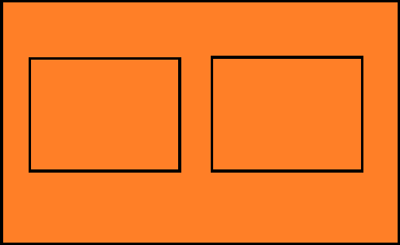

# 营造司物语游戏计划

注：左边的边框在文档描述中为左边，右边同理

# 项目开发文档

## 一、项目结构概览
主要目录结构如下：

### 1. 代码目录（codes/）
- **buildings/**：建筑相关逻辑，包括：
  - `building_resource.gd`：建筑资源管理
  - `building.gd`：建筑实体与操作
  - `flow/`：建筑流程（确认大致人选和四个具体流程）
    - `base_flow/`：流程基类与管理器
  - theme/：建筑主题相关逻辑
- **craftsmen/**：工匠相关逻辑，包括工匠角色、资源等。
- **environments/**：环境相关逻辑，管理环境要素。
- **global/**：全局逻辑, 自动加载。
- **ui/**：UI 逻辑，分为建筑、工匠、总确认等界面，以及基础 UI、属性 UI、选择 UI、流程 UI 等子模块。

### 2. 场景目录（scenes/）
- **main.tscn**：主场景入口。
- **buildings/**：建筑及其流程相关场景。
- **environments/**：环境场景。
- **ui/**：主 UI、基础 UI、建筑 UI、工匠 UI、流程 UI、分区列表等。
- **start/**：启动与设置场景。
---

## 二、功能需求

### 1. 建筑系统
#### 1.1 大致人选流程（TotalConfirm）
  - 左侧展示所有流程，自动计算最优员工并分配
  - 右侧按流程能力需求排序员工名单，显示能力值和状态（高亮需求能力）
  - 支持将员工分配到流程
  - 可勾选自动运行，后台自动执行

#### 1.2 人选确认环节（Confirm）
  - 左侧为员工名单，按能力、状态排序，根据`大致人选`结果高亮员工
  - 右侧显示员工能力值和状态（高亮需求能力）

#### 1.3 主题选取环节
  - 左侧上、中、下三个位置选取可选主题
  - 右侧显示主题属性和加成，支持预览效果
  -  引入“契合度”概念，影响 Reward 结果和奖励发放

#### 1.4 Build 工作环节
  - 文本框显示随机文本
  - 播放对应动画
  - 根据员工能力值、精力值及流程权重，计算建筑增值

#### 1.5 Placeholder 环节（集体工作）
  - 激活所有员工共同参与工作
  - 根据员工表现等因素，计算建筑增值

#### 1.6 Reward 奖励环节
  - 计算和发放公司名气值和金币等奖励

#### 需要考虑的情况和额外的功能
  - 员工能力升级后自动重新匹配
  - 员工离职/解雇时自动移除并触发重新分配
  - 新员工加入时自动纳入匹配池
  - 加速功能

### 2. 工匠系统

